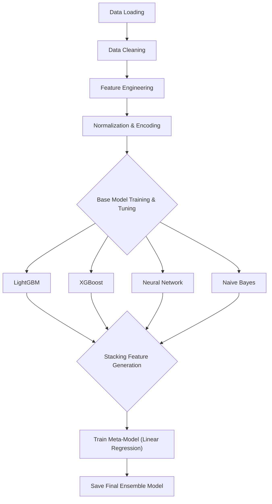

# Predicting Road Accident Risk

This project aims to predict the risk of road accidents based on various contributing factors. It utilizes a machine learning pipeline to process data, engineer features, and train multiple models, which are then combined into a stacking ensemble to produce the final prediction.

## The Competition

This project is my submission for the [Playground Series - Season 5, Episode 10](https://www.kaggle.com/competitions/playground-series-s5e10/overview) on Kaggle.

### Goal

The goal of this competition is to predict the severity of a road accident given the circumstances of the accident.

### Metric

Submissions are evaluated on the Mean Squared Error (MSE).

### Data

The data for this competition is synthetically generated and based on a previous competition, [Predicting Road Accident Severity in the UK](httpss://www.kaggle.com/competitions/prediction-of-road-accident-severity-in-the-uk).

## Project Workflow

The project follows a structured pipeline to ensure that data is processed efficiently and models are trained and evaluated systematically. The key stages of the pipeline are visualized below.



## Pipeline Steps

1.  **Data Loading**: The pipeline begins by loading the raw training data from the provided CSV files.

2.  **Data Cleaning**: To ensure data quality, any rows with missing values are removed from the dataset.

3.  **Feature Engineering**: New features are created from existing ones to improve model performance. This includes:
    *   Creating binary flags for conditions like rush hour, adverse weather, and poor lighting.
    *   Generating interaction features (e.g., `speed_limit` x `curvature`).
    *   Adding polynomial features to capture non-linear relationships.

4.  **Normalization and Encoding**: All categorical features are one-hot encoded, and numerical features are standardized using `StandardScaler` to bring them to a common scale.

5.  **Base Model Training and Tuning**: Four different models are trained and tuned using `Ray Tune` for hyperparameter optimization:
    *   **LightGBM**: A gradient boosting framework that uses tree-based learning algorithms.
    *   **XGBoost**: An optimized distributed gradient boosting library designed to be highly efficient, flexible, and portable.
    *   **Neural Network**: A feedforward neural network built with PyTorch.
    *   **Naive Bayes**: A simple and fast classification algorithm based on Bayes' theorem.

6.  **Stacking Ensemble**: The predictions from the best-performing base models are used as input to train a meta-model.
    *   **Meta-Model**: A Linear Regression model is used to learn the optimal combination of the base models' predictions.

7.  **Model Saving**: The trained base models and the final meta-model are saved for future use in the serving ensemble.

## Monitoring and Debugging

This project uses a custom `ModelLoggerCallback` to log detailed, model-specific information to TensorBoard. This allows for a "glass-box" view into the training process, making it easier to debug and understand model behavior.

To view the logs, run the following command in your terminal:

```sh
tensorboard --logdir=ray_results
```

This will start a TensorBoard server where you can visualize training metrics, hyperparameter comparisons, and, for the neural network, the distribution of weights and gradients.

## Models Used

This project employs a multi-model stacking ensemble to identify the best-performing algorithm for the task.

### Base Models

*   **LightGBM**: Known for its speed and efficiency, LightGBM is a great choice for tabular data and often provides a strong baseline. [Read more...](docs/lightgbm.md)

*   **XGBoost**: A powerful and popular gradient boosting library that is often a top performer in Kaggle competitions. [Read more...](docs/xgboost.md)

*   **Neural Network**: A simple feedforward neural network is used to capture complex non-linear patterns in the data that tree-based models might miss. [Read more...](docs/neural_network.md)

*   **Naive Bayes**: A simple and fast algorithm that serves as a good baseline. [Read more...](docs/naive_bayes.md)

### Meta-Model

*   **Linear Regression**: A simple and interpretable model that is used to combine the predictions of the base models. [Read more...](docs/linear_regression.md)

### Ensemble Learning

*   **Stacking**: This project uses a stacking ensemble to combine the strengths of multiple models and improve predictive performance. [Read more about the benefits of ensembling...](docs/ensembling.md)
